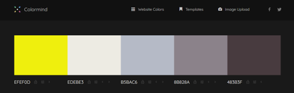

# STEM Stars

## Project Overview

‘STEM Stars’ provide female mentor’s to female school, college and university students studying STEM (Science, Technology, Engineering, Mathematics) and females employed directly in a STEM role. 

Research shows that there are high attrition rates for females through STEM education and employment. This eventually leads to a gender imbalance in STEM workplaces and therefore leads to a lack of available female mentors which compounds the issue. Gender inequality has been linked to reduced workplace productivity, gender bias and reduced support for females in the workplace for promotion and opportunities.

‘STEM Stars’ offers Schools, universities and companies access to STEM female mentors from around the globe so that females can be supported through their education with a female role model right through into the workplace. Female retention rates are therefore increased and gender inequality in the workplace reduced, benefiting both female individuals within their chosen career paths and companies aiming to improve their diversity, inclusivity and productivity.

The project gives an overview of the services provided by ‘STEM Stars’, examples of mentors and a contact us form for accessing more information.

## Project Goals

### User Goals
-	Find information about accessing female mentors for school, college or university level to include a company workplace.
-	Find examples of STEM female mentors provided by STEM Stars
-	Find the reasons why female mentors are of benefit to females studying or working in STEM
-	To be able to contact STEM stars for more information

### Site Owner Goals
-	To gain clients for the business
-	To promote the business overall
-	To provide information for potential clients about STEM Stars services
-	To provide a background to potential clients about why STEM Stars exists
-	To provide a way for potential and returning clients to contact STEM Stars

## User Experience

### Target Audience
-	Schools looking to encourage females into STEM, support, retain and get them through their studies into Higher Education.
-	Colleges looking to encourage females into STEM, support, retain and get them through their studies into Higher Education.
-	Universities looking to encourage females into STEM, support, retain them and get them through their studies and into the workplace.
-	STEM companies looking to support their female staff with mentors to assist with female staff retention and increase company diversity, inclusivity and productivity.

### User Requirements and Expectations
-	A navigation system that is familiar, simple and intuitive
-	Content that is provided in clear sections to make it easy to read
-	All links and functions work appropriately
-	A site that is responsive and works on a variety of screen sizes
-	A way to contact the business
-	A site that provides accessibility

## User Stories

### First-time User 
1.	As a first time user, I want to know what STEM Stars is about.
2.	As a first time user, I want to know some statistics about females leaving STEM education and STEM roles.
3.	As a first time user, I want to know what services STEM Stars provide.
4.	As a first time user, I want to see an example of a mentor.
5	As a first time user, I want to see a bio of a mentor.
6.	As a first time user, I want to be able to contact STEM Stars for more information and add a comment.

### Returning User
7.	As a returning user, I want to be able to contact or re-contact STEM Stars and add a comment.
8.	As a returning user, I want to be able to find STEM Stars on social media.

### Site Owner 
9.	As the site owner, I want users to be able to contact STEM Stars.
10.	As the site owner, I want users to be able to get an overview of what STEM Stars is about.
11.	As the site owner I want users to be able to see statistics about 
12.	As the site owner I want the users to be able to see examples of mentors that they can access including their bios.
13.	As the site owner I want users to be able to see what services STEM Stars offers.
14.	As the site owner I want users to be able to contact and re-contact STEM Stars for more information via a form

## Design

### Design Choices
The site will be visited by professionals from schools, colleges, universities and companies so the site is required to look professional, clear and concise. 

### Colour
Color mind was used to generate a palette of neutral colours for the site that are soft with a yellow that offers a distinctive contrast to add a splash off colour. This was to ensure that the site looks professional.
 

### Fonts
Google fonts has been imported and “Montserrat” has been used for all the text inside the website with sans-serif selected if a browser does not support the prior font.

### Structure
The page is structured in a user friendly, easily recognised, simple format. The first time user sees a typical navigation bar at the top of the page, with navigation links to the right. There is a footer at the bottom of the page containing the company name and links to social media sites.

The website consists of 5 separate pages: 
- A homepage consisting of a picture of females with computers with a text overlay and a button linking to the contact page. An about section giving an overview of STEM Stars. A section giving statistics regards females in STEM and issues with retention/attrition. A section to include 4 cards that each provide at a glance the services that STEM Stars offer. 
- A Mentor page with two cards showing an example of a female mentor from technology and a mentor from engineering. Each card has a button to a dedicated page which shows the individual mentors summary and bio. An embedded video explaining the benefits of mentors.
- A technology mentor page showing a picture, summary of the mentor and their bio.
- An Engineering mentor page showing a picture, summary of the mentor and their bio.
- A contact page with a contact form to ask for more information regards the service the site provides.
