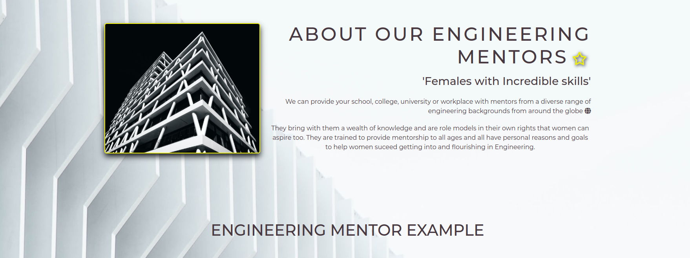
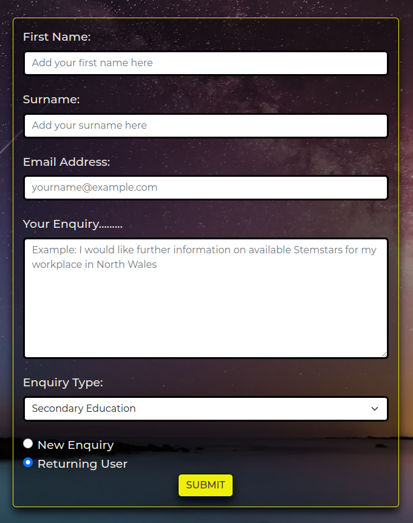
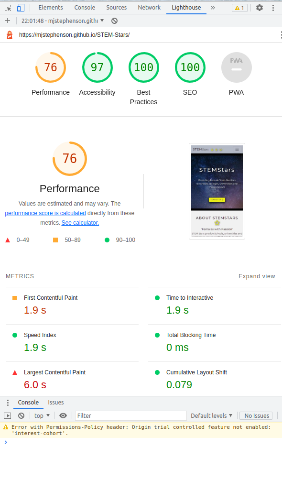
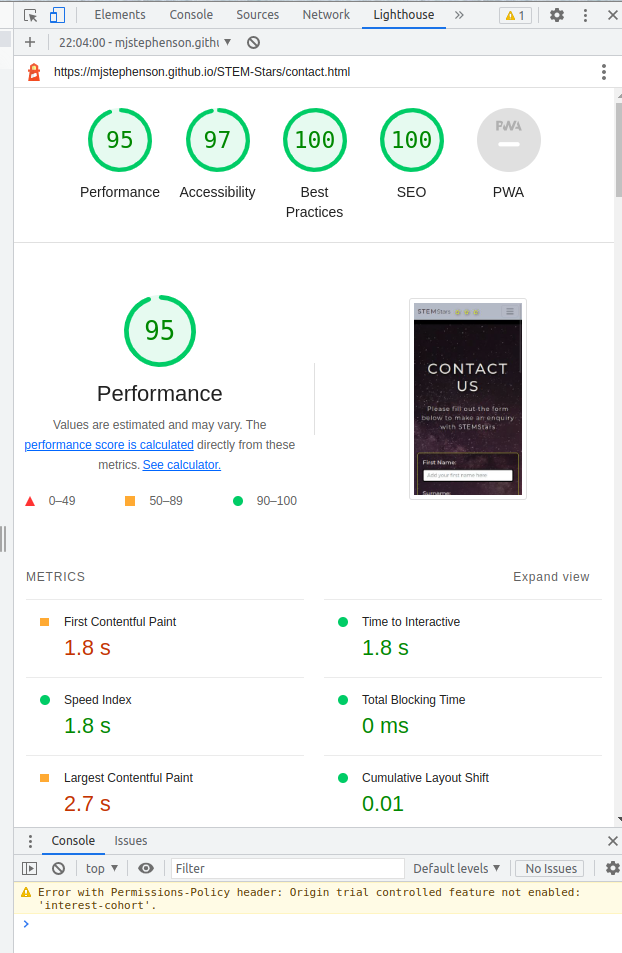

# STEM Stars

[Live webpage](https://mjstephenson.github.io/STEM-Stars/)

## Project Overview

‘STEM Stars’ provide female mentor’s to female school, college and university students studying STEM (Science, Technology, Engineering, Mathematics) and females employed directly in a STEM role. 

Research shows that there are high attrition rates for females through STEM education and employment. This eventually leads to a gender imbalance in STEM workplaces and therefore leads to a lack of available female mentors which compounds the issue. Gender inequality has been linked to reduced workplace productivity, gender bias and reduced support for females in the workplace for promotion and opportunities.

‘STEM Stars’ offers Schools, universities and companies access to STEM female mentors from around the globe so that females can be supported through their education with a female role model right through into the workplace. Female retention rates are therefore increased and gender inequality in the workplace reduced, benefiting both female individuals within their chosen career paths and companies aiming to improve their diversity, inclusivity and productivity.

The project gives an overview of the services provided by ‘STEM Stars’, examples of mentors and a contact us form for accessing more information.

## Project Goals

### User Goals
-	Find information about accessing female mentors for school, college or university level to include a company workplace.
-	Find examples of STEM female mentors provided by STEM Stars
-	Find the reasons why female mentors are of benefit to females studying or working in STEM
-	To be able to contact STEM stars for more information

### Site Owner Goals
-	To gain clients for the business
-	To promote the business overall
-	To provide information for potential clients about STEM Stars services
-	To provide a background to potential clients about why STEM Stars exists
-	To provide a way for potential and returning clients to contact STEM Stars

## User Experience

### Target Audience
-	Schools looking to encourage females into STEM, support, retain and get them through their studies into Higher Education.
-	Colleges looking to encourage females into STEM, support, retain and get them through their studies into Higher Education.
-	Universities looking to encourage females into STEM, support, retain them and get them through their studies and into the workplace.
-	STEM companies looking to support their female staff with mentors to assist with female staff retention and increase company diversity, inclusivity and productivity.

### User Requirements and Expectations
-	A navigation system that is familiar, simple and intuitive
-	Content that is provided in clear sections to make it easy to read
-	All links and functions work appropriately
-	A site that is responsive and works on a variety of screen sizes
-	A way to contact the business
-	A site that provides accessibility

## User Stories

### First-time User 
1.	As a first time user, I want to know what STEM Stars is about.
2.	As a first time user, I want to know some statistics about females leaving STEM education and STEM roles.
3.	As a first time user, I want to know what services STEM Stars provide.
4.	As a first time user, I want to see an example of a mentor.
5.	As a first time user, I want to see a bio of a mentor.
6.  As a first time user, I want to see the education of the mentor.
7.  As a first time user, I want to see the certificates the mentor holds.
8.  As a first time user, I want to be able so see when the mentors are available
9.	As a first time user, I want to be able to contact STEM Stars for more information and add a comment.

### Returning User
10.	As a returning user, I want to be able to contact or re-contact STEM Stars and add a comment.
11.	As a returning user, I want to be able to find STEM Stars on social media.

### Site Owner 
12.	As the site owner, I want users to be able to contact STEM Stars.
13.	As the site owner, I want users to be able to get an overview of what STEM Stars is about.
14.	As the site owner I want users to be able to see statistics about females in STEM
15.	As the site owner I want the users to be able to see examples of mentors that they can access and information about them.
16.	As the site owner I want users to be able to see what services STEM Stars offers.
17.	As the site owner I want users to be able to contact and re-contact STEM Stars for more information via a form

## Design

### Design Choices
The site will be visited by professionals from schools, colleges, universities and companies so the site is required to look professional, clear and concise. 

### Colour
Color mind was used to generate a palette of neutral colours for the site that are soft with a yellow that offers a distinctive contrast to add a splash off colour. This was to ensure that the site looks professional.
 

### Fonts
Google fonts has been imported and “Montserrat” has been used for all the text inside the website with sans-serif selected if a browser does not support the prior font.

### Structure
The page is structured in a user friendly, easily recognised, simple format. The first time user sees a typical navigation bar at the top of the page, with navigation links to the right. There is a footer at the bottom of the page containing the company name and links to social media sites.

The website consists of 5 separate pages: 
- A homepage consisting of a picture of females with computers with a text overlay and a button linking to the contact page. An about section giving an overview of STEM Stars. A section giving statistics regards females in STEM and issues with retention/attrition. A section to include 4 cards that each provide at a glance the services that STEM Stars offer. 
- A Mentor page with two cards showing an example of a female mentor from technology and a mentor from engineering. Each card has a button to a dedicated page which shows the individual mentors summary and bio. An embedded video explaining the benefits of mentors.
- A technology mentor page showing a picture, summary of the mentor and their bio.
- An Engineering mentor page showing a picture, summary of the mentor and their bio.
- A contact page with a contact form to ask for more information regards the service the site provides.

## Wireframes

Home

Mentors

Tech Mentor

Engineering Mentor

Contact

The final tech and engineer pages deviated slightly from the wireframes as the project was completed as changing the layout with 2 cards side by side seemed to look better overall on a large screen. The cards all line up vertically on smaller screens as this was the best fit for the screen width.

## Technologies Used

### Languages

- HTML 
- CSS

### Tools

- [GitHub](https://www.github.com) - For an online secure location (site repository) for code and version control
- [Gitpod](https://www.gitpod.io/) – A cloud based IDE for development, with terminal used to add, commit and push to github 
- [Balsamiq](https://balsamiq.com/) – To design wireframes 
- [Bootstrap](https://www.getbootstrap.com/) – For layout responsiveness 
- [GoogleFonts](https://www.fonts.google.com/) - For Typography 
- [Colormind](https://www.colormind.io/) – For designing and generating a colour pallet 
- [Font_Awesome](https://www.fontawesome.com/) - For a library of icons 
- [TinyPNG](https://tinypng.com/) - For image compression
- [Cloud_convert](https://cloudconvert.com/) - for png and jpeg to WEBP conversion
- [Aspose](https://products.aspose.app/imaging/image-compress/webp) for WEBP compression
- Chrome dev tools for debugging and testing responsiveness during development

## Features

### Logo and Navigation Bar

- Features across all five pages
- The navbar responds fully and includes links to the Homepage, Mentors, and Contact page
- It allows users to easily navigate around the website
- The language icon and text size icon are included for accessibility and would be implemented if the site were to be developed further and so currently are inactive

### Footer
-	Provides external links to social media profiles for STEM Stars
- Provides a link to my personal Github
-	Links open new tabs in windows when clicked
-	User stories covered: 11

### Homepage

#### Image with Button
-	Brief explanation of STEM Stars
-	Button linking to contact page
-	User stories covered: 1,3,12,13,16

#### About section
-	Image of women in tech
-	Text describing what STEM Stars is about
-	User stories covered: 1,3,13,16

#### Statistics section
-	An image of statistics regards female retention in STEM
-	Text to explain the statistics regards female retention in STEM
-	User stories covered: 2,14

#### Services provided section
-	4 cards, each describing a service provided by STEM Stars
-	User stories covered: 3,16

### Mentors Page

#### Introduction
- A horizontal card frames text to introduce users to the mentors that are provided and directs users to click on the mentor card buttons to view their experience and qualifications
- User sories covered: 3,13

#### Card 1
-	An image of a female tech mentor and a short description explaining what they do including a button linking to the tech mentor bio page
-	User stories covered: 4

#### Card 2
-	An image of a female engineering mentor and a short description explaining what they do including a button linking to the engineering mentor bio page.
-	User stories covered: 4

#### Video
-	Contains a you-tube video on female mentors
-	User stories covered: 2

### Tech Mentor Page

#### image and Tech Mentor About Section
-   A technology related image of a laptop
-   A title and subtitle with text explaining how STEMstars provides tech mentors
-   User stories covered: 3,13,16

#### Mentor Card
-	Image of Female Tech mentor
-   User stories covered: 4

#### Bio of Tech Mentor
-	Text description of a bio for the example of a Tech STEMStar mentor
-   User stories covered: 4

#### Education Card
-	Contains a card giving the education of the mentor
-   User stories covered: 6

#### Certification Card
-   Contains a card showing the certicates the mentor holds
-   User stories covered: 7

#### Availability Timetable
-   Added a table showing availability as an addition to the wireframes
-	User stories covered: 8

#### Back to top Button
-   A button that takes you back to the top of the page so the user can access the navbar quickly

### Engineering Mentor Page

#### image and Engineering Mentor About Section
-   A technology related image of a laptop
-   A title and subtitle with text explaining how STEMstars provides engineering mentors
-   User stories covered: 3,13,16

#### Mentor Card
-	Image of Female Engineering mentor
-   User stories covered: 4

#### Bio of Engineering Mentor
-	Text description of a bio for the example of a Engineering STEMStar mentor
-   User stories covered: 4

#### Education Card
-	Contains a card giving the education of the mentor
-   User stories covered: 6

#### Certification Card
-   Contains a card showing the certicates the mentor holds
-   User stories covered: 7

#### Availability Timetable
-   Added a table showing availability as an addition to the wireframes - see tech mentor page
-	User stories covered: 4,12

#### Back to top Button
-   A button that takes you back to the top of the page so the user can access the navbar quickly - see tech mentor page

### Contact Page

#### Title and text
-	Text asking the user to fill out the form to make an enquiry

#### Contact form
-	A contact form is provided so that the user can leave a message for STEM stars that includes input fields for: name, email, contact number and a comment.
-	The user can select whether they are a new or returning user
-	User stories covered: 9,10,17

## Validation

### HTML Validation
The W3C Markup Validation Service was used to validate the HTML of the website. All of the pages passed with no errors and no warnings to show.

Home

Mentors

Contact

Tech Mentor

Engineering Mentor

### CSS Validation
The W3C Jigsaw CSS Validation Service was used to validate the CSS of the website.
When validating custom CSS it passes with no errors found

Style.css

### Accessibility
The WAVE WebAIM web accessibility evaluation tool was used to ensure the website met high accessibility standards.
Upon testing the homepage errors were found in the social media links in the footer. The links contain no text and the function or purpose of the link will not be presented to the user. This can introduce confusion for keyboard and screen reader users and is highlighted by the red link icons.
This was fixed by adding `facebook` to each icon link in the footer code.

All pages now pass with 0 errors.

Home

Mentors

Contact

Tech Mentor

Eng Mentor

### Performance 
Google Lighthouse within Google Chrome Developer Tools was utilised to test the performance, accessibility, best practice and SEO
The tests returned some performance issues but after discussions with tutors it was deemed that these were related to hosting the site on github. For example Lighthouse was run by my tutor 'Tim' and his test returned 92% on the homepage compared to my 7%

Home

Mentors

Contact

Tech Mentor

Engineeering Mentor

### Performing tests on devices 
The website was tested on the following devices:
- Asus Vivobook 15"
- 24" monitor
- iphone X

Home

Mentors

Contact

Tech Mentor

Engineeering Mentor

- iPhone 13 Pro

## Bugs

There were a range of bugs that needed to be fixed for html validation. They mainly consisted of open and unclosed elements such as divs. There were also bugs where there were to many open sections and stray tags that needed to be deleted.

| **Bug** | **Fix** |
| ----------- | ----------- |
| Image overflowed beneath the footer so that the footer was 2/3 up the page |  wrap the page in divs with id's of page container and content wrap |
| Extra / at and of css link| remove the /  |
| the element button should not appear a a descendant of `<a>` | remove type=button  |
| used a path rather than relative path for index.html hero image| use a relative path |

### Testing user stories

1. As a first time user, I want to know what STEM Stars is about.

| **Feature** | **Action** | **Expected Result** | **Actual Result** |
|-------------|------------|---------------------|-------------------|
| Hero Image on homepage | open landing page | details shown about stemstars | Works as expected |
| About section on homepage | Scroll down on home page to about section | shows the about section | Works as expected |

Screenshots

2. As a first time user I want to know some statistics about females leaving STEM education and STEM roles.

| **Feature** | **Action** | **Expected Result** | **Actual Result** |
|-------------|------------|---------------------|-------------------|
| Statistics section | Scroll down on home page to about section | shows the statistics section| Works as expected |

Screenshots

3. As a first time user, I want to know what services STEM Stars provide.

| **Feature** | **Action** | **Expected Result** | **Actual Result** |
|-------------|------------|---------------------|-------------------|
| Services section | Scroll down on home page | Find 4 cards showing the services offered| Works as expected |

Screenshots

4. As a first time user, I want to see an example of a mentor.

| **Feature** | **Action** | **Expected Result** | **Actual Result** |
|-------------|------------|---------------------|-------------------|
| Mentor card| Navigate to the mentor page | find a card showing a mentor | Works as expected |
| Tech mentor example | Navigate to the tech mentor page | shows information on tech mentor | Works as expected |
| Engineer mentor example | On engineer mentor page | shows information on tech mentor | Works as expected |

Screenshots

5. As a first time user, I want to see a bio of a mentor.

| **Feature** | **Action** | **Expected Result** | **Actual Result** |
|-------------|------------|---------------------|-------------------|
| Tech mentor page | Navigate to the tech mentor page | find the bio card | Works as expected |
| Engineering mentor page | Navigate to the engineering mentor page | find the bio card | Works as expected |

Screenshots

6. As a first time user, I want to see the education of the mentor.

| **Feature** | **Action** | **Expected Result** | **Actual Result** |
|-------------|------------|---------------------|-------------------|
| Tech mentor page | Navigate to the tech mentor page | find the education card | Works as expected |
| Engineering mentor page | Navigate to the engineering mentor page | find the education card | Works as expected |

Screenshots

7. As a first time user, I want to see the certificates the mentor holds.

| **Feature** | **Action** | **Expected Result** | **Actual Result** |
|-------------|------------|---------------------|-------------------|
| Tech mentor page | Navigate to the tech mentor page | find the certificate card | Works as expected |
| Engineering mentor page | Navigate to the engineering mentor page | find the certificate card | Works as expected |

Screenshots

8. As a first time user, I want to be able so see when the mentors are available

| **Feature** | **Action** | **Expected Result** | **Actual Result** |
|-------------|------------|---------------------|-------------------|
| Tech mentor page | Navigate to the tech mentor page | find the timetable | Works as expected |
| Engineering mentor page | Navigate to the engineering mentor page | find the timetable | Works as expected |

Screenshots

9. As a first time user, I want to be able to contact STEM Stars for more information and add a comment.

| **Feature** | **Action** | **Expected Result** | **Actual Result** |
|-------------|------------|---------------------|-------------------|
| Contact Form| Navigate to the Contact Page and, fill out and submit contact form | Data submited via contact form | Works as expected |

Screenshots

10. As a returning user, I want to be able to contact or re-contact STEM Stars and add a comment.

| **Feature** | **Action** | **Expected Result** | **Actual Result** |
|-------------|------------|---------------------|-------------------|
| Contact Form| Navigate to the Contact Page , fill out click returning user buttonand submit contact form | Data submited via contact form | Works as expected |

Screenshots

11. As a returning user, I want to be able to find STEM Stars on social media.

| **Feature** | **Action** | **Expected Result** | **Actual Result** |
|-------------|------------|---------------------|-------------------|
| footer | On any page click the social icons | opens a new social media page | Works as expected |

Screenshots

12. As the site owner, I want users to be able to contact STEM Stars.

| **Feature** | **Action** | **Expected Result** | **Actual Result** |
|-------------|------------|---------------------|-------------------|
| Contact Form| Navigate to the Contact Page and, fill out and submit contact form | Data submited via contact form | Works as expected |

Screenshots

13.	As the site owner, I want users to be able to get an overview of what STEM Stars is about.

| **Feature** | **Action** | **Expected Result** | **Actual Result** |
|-------------|------------|---------------------|-------------------|
| Hero Image on homepage | open landing page | details shown about stemstars | Works as expected |
| About section on homepage | Scroll down on home page to about section | shows the about section | Works as expected |

Screenshots

14.	As the site owner I want users to be able to see statistics about females in STEM

| **Feature** | **Action** | **Expected Result** | **Actual Result** |
|-------------|------------|---------------------|-------------------|
| Statistics section | Scroll down on home page to about section | shows the statistics section| Works as expected |

Screenshots

15.	As the site owner I want the users to be able to see examples of mentors that they can access and information about them.

| **Feature** | **Action** | **Expected Result** | **Actual Result** |
|-------------|------------|---------------------|-------------------|
| Mentor card| Navigate to the mentor page | find a card showing a mentor | Works as expected |
| Tech mentor example | Navigate to the tech mentor page | shows information on tech mentor | Works as expected |
| Engineer mentor example | On engineer mentor page | shows information on tech mentor | Works as expected |

Screenshots

16.	As the site owner I want users to be able to see what services STEM Stars offers.

| **Feature** | **Action** | **Expected Result** | **Actual Result** |
|-------------|------------|---------------------|-------------------|
| Services section | Scroll down on home page | Find 4 cards showing the services offered| Works as expected |

Screenshots

17.	As the site owner I want users to be able to contact and re-contact STEM Stars for more information via a form

| **Feature** | **Action** | **Expected Result** | **Actual Result** |
|-------------|------------|---------------------|-------------------|
| Contact Form| Navigate to the Contact Page , fill out click new/returning user button and submit contact form | Data submited via contact form | Works as expected |

Screenshots

## Deployment

The site was deployed to GitHub pages. The steps to deploy are as follows: 
  - In the [GitHub repository](https://github.com/MJstephenson/STEM-Stars), navigate to the Settings tab 
  - From the source section drop-down menu, select the **Main** Branch, then click "Save".
  - The page will be automatically refreshed with a detailed ribbon display to indicate the successful deployment.

The live link can be found [here](https://mjstephenson.github.io/STEM-Stars)

### Local Deployment

You can clone the repository by following these steps:

1. Go to the [GitHub repository](https://github.com/MJstephenson/STEM-Stars) 
2. Locate the Code button above the list of files and click it 
3. Select if you prefer to clone using HTTPS, SSH, or GitHub CLI and click the copy button to copy the URL to your clipboard
4. Open Git Bash
5. Change the current working directory to the one where you want the cloned directory
6. In your IDE Terminal, type the following command to clone my repository:
  - `git clone https://github.com/MJstephenson/STEM-Stars.git`
7. Press Enter to create your local clone.

Alternatively, if using Gitpod, you can click below to create your own workspace using this repository.

## Credits

All images are taken from [unsplash.com](https://unsplash.com/) posted by [Andy Holmes](https://unsplash.com/@andyjh07), [Kriss Roller](https://unsplash.com/@krisroller), [ryan hutton](https://unsplash.com/@ryan_hutton), [Joel Filipe](https://unsplash.com/@joelfilip), [christina](https://unsplash.com/@wocintechchat), [Ally Griffin](https://unsplash.com/@pixel_goods), [CoWomen](https://unsplash.com/@cowomen), [Nathan da Silva ](https://unsplash.com/@silvawebdesigns) and [Ricardo Gomez Angel](https://unsplash.com/@rgaleriacom)

with the exception of the statistics image which was taken from [PWC](https://www.pwc.co.uk/who-we-are/women-in-technology/time-to-close-the-gender-gap.html).com

The women in tech you-tube video was sourced from [you-tube](https://www.youtube.com/watch?v=dUYJvtAg8aU)

## Acknowledgements
I would like to take the opportunity to thank:
- My mentor Tim for his feedback, advice, guidance and support.
- Tutoring from Josh and Steve at the code institute for guiding me through issues with page overflow and grid layouts
- The students, alumini and mentors that took the time to answer my questions Code institutes Slack
- Myself for putting all the time in to get this project done through all the late nights after work and weekends.
- My wife and little boy for listening to me talk about coding non-stop
