# Testing

Return back to the [README.md](README.md) file.

## Validation

### HTML Validation
The W3C Markup Validation Service was used to validate the HTML of the website. All of the pages passed with no errors and no warnings to show.

Home

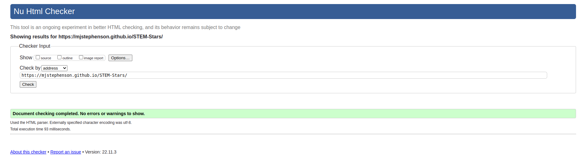

Mentors

Contact

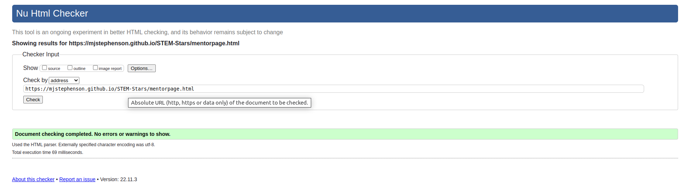

Tech Mentor

Engineering Mentor

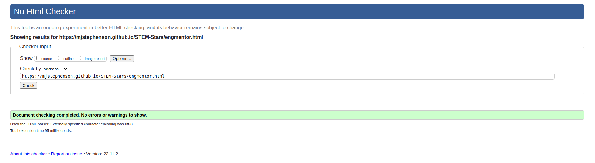

### CSS Validation
The W3C Jigsaw CSS Validation Service was used to validate the CSS of the website.
When validating custom CSS it passes with no errors found

Style.css

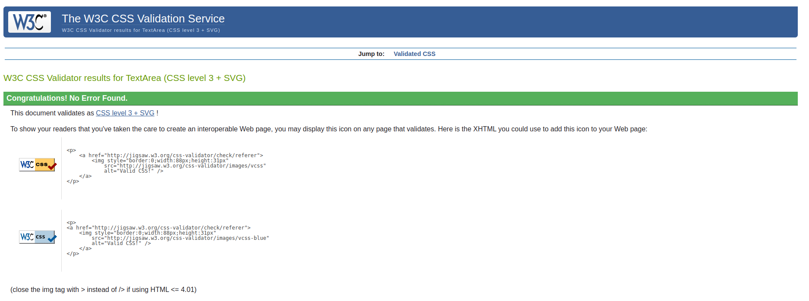

### Accessibility
The WAVE WebAIM web accessibility evaluation tool was used to ensure the website met high accessibility standards.
Upon testing the homepage errors were found in the social media links in the footer. The links contain no text and the function or purpose of the link will not be presented to the user. This can introduce confusion for keyboard and screen reader users and is highlighted by the red link icons.
This was fixed by adding `facebook` to each icon link in the footer code.

All pages now pass with 0 errors.

Home

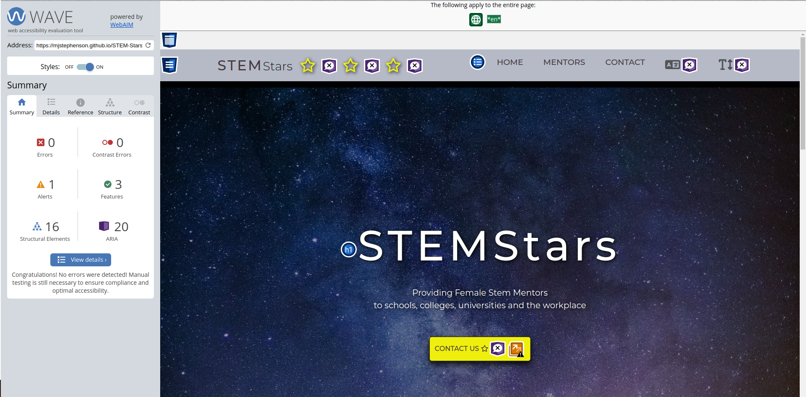

Mentors

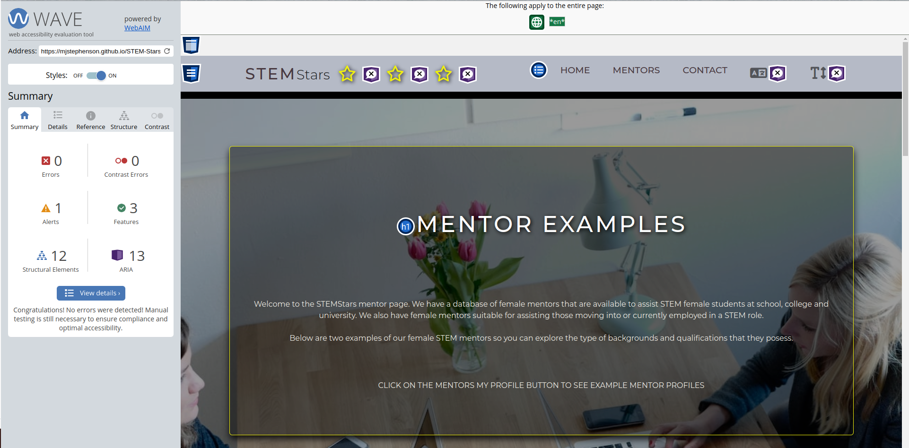

Contact

Tech Mentor

Eng Mentor

### Performance 
Google Lighthouse within Google Chrome Developer Tools was utilised to test the performance, accessibility, best practice and SEO
The tests returned some performance issues but after discussions with tutors it was deemed that these were related to hosting the site on github. For example Lighthouse was run by my tutor 'Tim' and his test returned 92% on the homepage compared to my 76%

Home

Mentors

Contact

Tech Mentor

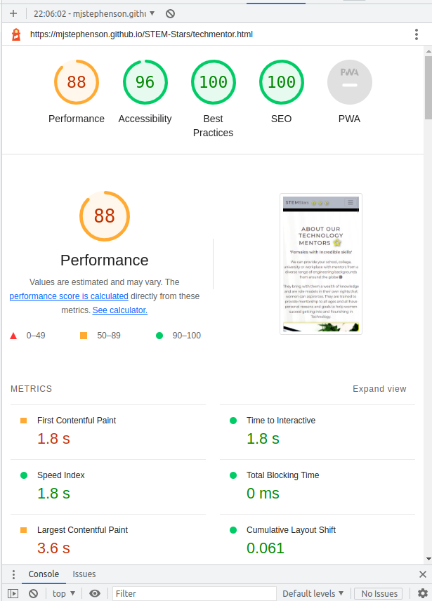

Engineeering Mentor

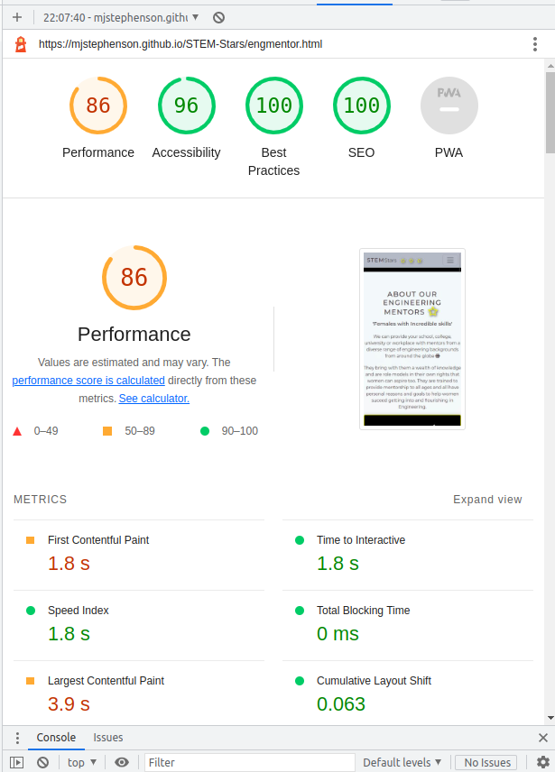

### Performing tests on devices 
The website was tested on the following devices:

#### Iphone X (375 wide)

Home

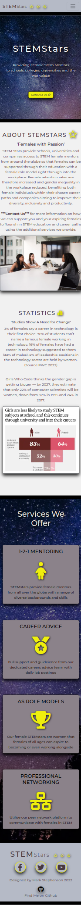

Mentors

Contact

Tech Mentor

Engineeering Mentor

#### Surface Duo (540 wide)

Home

Mentors

Contact

Tech Mentor

Engineeering Mentor

#### Ipad (768 wide)

Home

Mentors

Contact

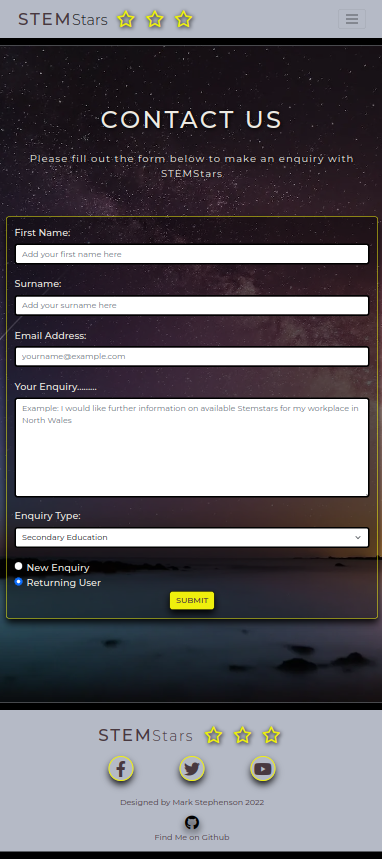

Tech Mentor

Engineeering Mentor

#### Nest Hub Max (1280 wide)

Home

Mentors

Contact

Tech Mentor

Engineeering Mentor

#### 24 inch monitor

Home

Mentors

Contact

Tech Mentor

Engineeering Mentor

### Bugs

There were a range of bugs that needed to be fixed for html validation. They mainly consisted of open and unclosed elements such as divs. There were also bugs where there were to many open sections and stray tags that needed to be deleted.

| **Bug** | **Fix** |
| ----------- | ----------- |
| Image overflowed beneath the footer so that the footer was 2/3 up the page |  wrap the page in divs with id's of page container and content wrap |
| Extra / at and of css link| remove the /  |
| the element button should not appear a a descendant of `<a>` | remove type=button  |
| used a path rather than relative path for index.html hero image| use a relative path |

### Testing user stories

1. As a first time user, I want to know what STEM Stars is about.

| **Feature** | **Action** | **Expected Result** | **Actual Result** |
|-------------|------------|---------------------|-------------------|
| Hero Image on homepage | open landing page | details shown about stemstars | Works as expected |
| About section on homepage | Scroll down on home page to about section | shows the about section | Works as expected |
| About section on eng mentor page | top section | shows the about section | Works as expected |
| About section on eng mentor page | top section | shows the about section | Works as expected |

Screenshots

2. As a first time user I want to know some statistics about females leaving STEM education and STEM roles.

| **Feature** | **Action** | **Expected Result** | **Actual Result** |
|-------------|------------|---------------------|-------------------|
| Statistics section | Scroll down on home page to about section | shows the statistics section| Works as expected |

Screenshots

3. As a first time user, I want to know what services STEM Stars provide.

| **Feature** | **Action** | **Expected Result** | **Actual Result** |
|-------------|------------|---------------------|-------------------|
| Services section | Scroll down on home page | Find 4 cards showing the services offered| Works as expected |

Screenshots

4. 4.	As a first time user, I want to see an example of a mentor.

| **Feature** | **Action** | **Expected Result** | **Actual Result** |
|-------------|------------|---------------------|-------------------|
| Mentor card| Navigate to the mentor page | find a card showing a mentor and use the about me links to navigate to the individual mentor pages | Works as expected |

Screenshots

5. As a first time user, I want to see a bio of a mentor.

| **Feature** | **Action** | **Expected Result** | **Actual Result** |
|-------------|------------|---------------------|-------------------|
| Tech mentor page | Navigate to the tech mentor page | find the bio card | Works as expected |
| Engineering mentor page | Navigate to the engineering mentor page | find the bio card | Works as expected |

Screenshots

6. As a first time user, I want to see the education of the mentor.

| **Feature** | **Action** | **Expected Result** | **Actual Result** |
|-------------|------------|---------------------|-------------------|
| Tech mentor page | Navigate to the tech mentor page | find the education card | Works as expected |
| Engineering mentor page | Navigate to the engineering mentor page | find the education card | Works as expected |

Screenshots

7. As a first time user, I want to see the certificates the mentor holds.

| **Feature** | **Action** | **Expected Result** | **Actual Result** |
|-------------|------------|---------------------|-------------------|
| Tech mentor page | Navigate to the tech mentor page | find the certificate card | Works as expected |
| Engineering mentor page | Navigate to the engineering mentor page | find the certificate card | Works as expected |

Screenshots

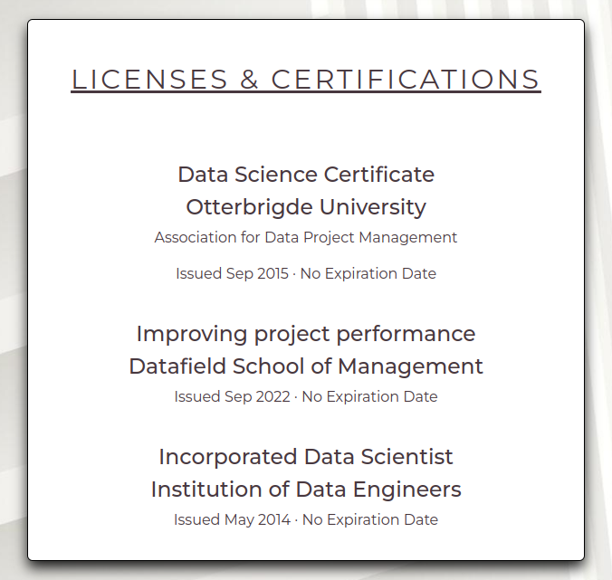

8. As a first time user, I want to be able so see when the mentors are available

| **Feature** | **Action** | **Expected Result** | **Actual Result** |
|-------------|------------|---------------------|-------------------|
| Tech mentor page | Navigate to the tech mentor page | find the timetable | Works as expected |
| Engineering mentor page | Navigate to the engineering mentor page | find the timetable | Works as expected |

Screenshots

9. As a first time user, I want to be able to contact STEM Stars for more information and add a comment.

| **Feature** | **Action** | **Expected Result** | **Actual Result** |
|-------------|------------|---------------------|-------------------|
| Contact Form| Navigate to the Contact Page and, fill out and submit contact form | Data submited via contact form | Works as expected |

Screenshots

10. As a returning user, I want to be able to contact or re-contact STEM Stars and add a comment.

| **Feature** | **Action** | **Expected Result** | **Actual Result** |
|-------------|------------|---------------------|-------------------|
| Contact Form| Navigate to the Contact Page , fill out click returning user buttonand submit contact form | Data submited via contact form | Works as expected |

Screenshots

11. As a returning user, I want to be able to find STEM Stars on social media.

| **Feature** | **Action** | **Expected Result** | **Actual Result** |
|-------------|------------|---------------------|-------------------|
| footer | On any page click the social icons | opens a new social media page | Works as expected |

Screenshots

12. As the site owner, I want users to be able to contact STEM Stars.

| **Feature** | **Action** | **Expected Result** | **Actual Result** |
|-------------|------------|---------------------|-------------------|
| Contact Form| Navigate to the Contact Page and, fill out and submit contact form | Data submited via contact form | Works as expected |

Screenshots

13.	As the site owner, I want users to be able to get an overview of what STEM Stars is about.

| **Feature** | **Action** | **Expected Result** | **Actual Result** |
|-------------|------------|---------------------|-------------------|
| Hero Image on homepage | open landing page | details shown about stemstars | Works as expected |
| About section on homepage | Scroll down on home page to about section | shows the about section | Works as expected |
| About section on eng mentor page | top section | shows the about section | Works as expected |
| About section on eng mentor page | top section | shows the about section | Works as expected |

Screenshots

14.	As the site owner I want users to be able to see statistics about females in STEM

| **Feature** | **Action** | **Expected Result** | **Actual Result** |
|-------------|------------|---------------------|-------------------|
| Statistics section | Scroll down on home page to about section | shows the statistics section| Works as expected |

Screenshots

15.	As the site owner I want the users to be able to see examples of mentors and be taken to a page where they can access information about them.

| **Feature** | **Action** | **Expected Result** | **Actual Result** |
|-------------|------------|---------------------|-------------------|
| Mentor card| Navigate to the mentor page | find a card showing a mentor and use the about me links to navigate to the individual mentor pages | Works as expected |
| Tech mentor example | Navigate to the tech mentor page | shows information on tech mentor | Works as expected |
| Engineer mentor example | On engineer mentor page | shows information on tech mentor | Works as expected |

Screenshots

16.	As the site owner I want users to be able to see what services STEM Stars offers.

| **Feature** | **Action** | **Expected Result** | **Actual Result** |
|-------------|------------|---------------------|-------------------|
| Services section | Scroll down on home page | Find 4 cards showing the services offered| Works as expected |

Screenshots

17.	As the site owner I want users to be able to contact and re-contact STEM Stars for more information via a form

| **Feature** | **Action** | **Expected Result** | **Actual Result** |
|-------------|------------|---------------------|-------------------|
| Contact Form| Navigate to the Contact Page , fill out click new/returning user button and submit contact form | Data submited via contact form | Works as expected |

Screenshots

